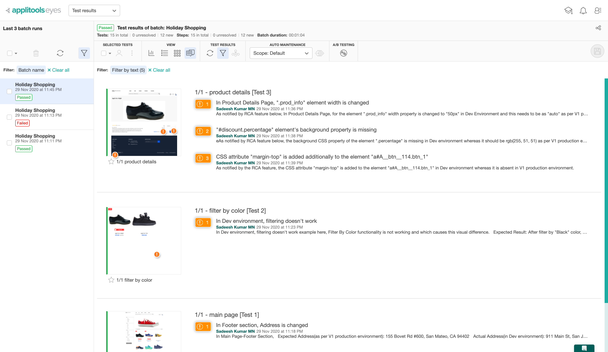

# Applitools Holiday Shopping Hackathon

## About the Hackathon
Please refer the instructions [here](https://applitools.com/hackathon-v20-3-instructions/)

## Setup & Execution
   + Test Automation Framework Used:[Webdriver.io](https://webdriver.io/). 
     About Prerequisite of the tool, Please refer [here](https://webdriver.io/docs/gettingstarted.html)
   + Clone/Import this [repo](https://github.com/SadeeshKumarMN/applitools-hackathon-2020.git) in preferred IDE
   + To install the dependencies, **npm install**
   + Set the value of an environment variable APPLITOOLS_API_KEY based on our OS as mentioned [here](https://www.npmjs.com/package/@applitools/eyes-webdriverio#applitools-api-key).
   + To run the Part1 Tests on V1 Production Environment, **ENV=V1_PROD npm run suite_applifashion**
   + To run the Part2 Tests on Dev Environment, **ENV=DEV npm run suite_applifashion**
   + To run the Part3 Tests on V2 Production Environment, **ENV=V2_PROD npm run suite_applifashion**

